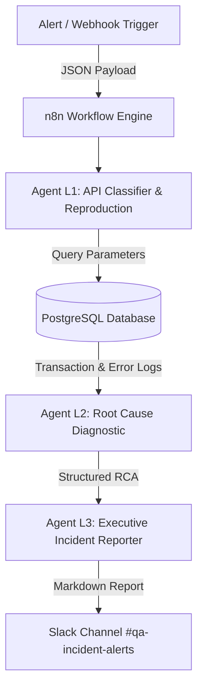

# 🤖 Autonomous QA & Incident Triage System (n8n + AI Agents)

An end-to-end autonomous incident response and QA triage pipeline powered by **n8n**, **LLM Function Calling**, and **Slack ChatOps**. The system intercepts infrastructure/API failure webhooks, inspects backend state via PostgreSQL, performs AI-driven Root Cause Analysis (RCA), and generates actionable remediation reports directly to SRE/QA teams.

---

## 📐 System Architecture



---

## ✨ Key Features

* **Event-Driven Incident Intake:** Webhook receiver capable of handling payment timeouts, database locks, and payload errors.
* **Multi-Agent AI Triage:**
  * **Agent L1:** Parses incident payloads, classifies severity, and generates reproduction cURL calls.
  * **Agent L2:** Queries live PostgreSQL logs to verify local state vs. upstream service health.
  * **Agent L3:** Formats executive-grade incident write-ups with actionable SRE steps and manual retry payloads.
* **Production ChatOps Integration:** Automated Slack notifications mapped to `#qa-incident-alerts`.

---

## 🛠️ Tech Stack

* **Orchestration:** n8n (Self-hosted via Docker)
* **LLM Engine:** Claude 3.5 Sonnet / GPT-4o (via OpenRouter/Custom Provider)
* **Database:** PostgreSQL 15
* **ChatOps:** Slack Webhook / API (`chat:write`)
* **Simulation Stack:** Node.js / Express

---

## 🚀 Quickstart & Reproduction

1. **Spin up Infrastructure:**
   ```bash
   docker run -d --name postgres_qa -p 5432:5432 -e POSTGRES_PASSWORD=qa_password postgres:15
   docker run -d --name n8n_qa -p 5678:5678 docker.n8n.io/n8nio/n8n
   ```

2. **Trigger Sample Incident (Payment Gateway Timeout):**
   ```bash
   curl -X POST http://localhost:3000/api/v1/trigger-incident \
     -H "Content-Type: application/json" \
     -d '{
       "incident_type": "PAYMENT_GATEWAY_TIMEOUT",
       "payload": {
         "transaction_id": "TX_TIMEOUT_99",
         "amount": 150.00,
         "provider": "Yalutec_Pay_Gateway"
       }
     }'
   ```